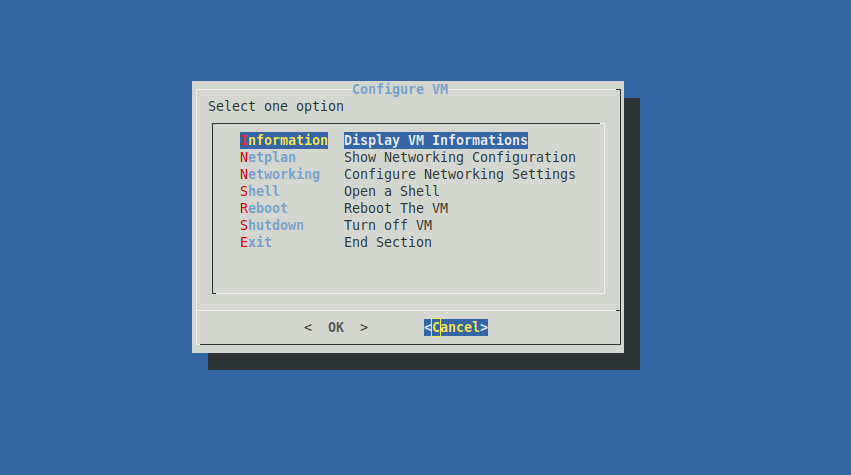

# The Basic  Shell Script Dialog For Ubuntu Server

This is a basic  example of a Shell Script dialog for Ubuntu server.




# Install

```
sudo apt install dialog
sudo apt install zip
```
# Download the files and extract it
```
wget https://github.com/KeystoneDevBr/basic_dialog/archive/refs/heads/main.z

unzip main.zip 
```
# Copy the files for directory /etc/profile.d

The struture the file needs be like this:

/etc/profile.d/dialog.sh
/etc/profile.d/dialog.d/index.sh
/etc/profile.d/dialog.d/f_config_ip.sh

# Verify the structure of files

```
ls -lar /etc/profile.d/dialog.*
```
**Output**: 

```
-rwxrwxr-x 1 root root   90 Dec 12 17:22 /etc/profile.d/dialog.sh

/etc/profile.d/dialog.d:
total 20
-rwxrwxr-x 1 root root 3323 Dec 12 17:22 index.sh
-rwxrwxr-x 1 root root 4859 Dec 12 17:22 f_config_ip.sh
```

# Change the owner of files for root

```
sudo chown root.root -R /etc/profile.d/dialog.*
```

# Turn all files executable

```
sudo chmod 775 -R /etc/profile.d/dialog.*
```

# Exit and start a new section
```
exit


ssh  <cliente_name>@<server_address>

```
```
